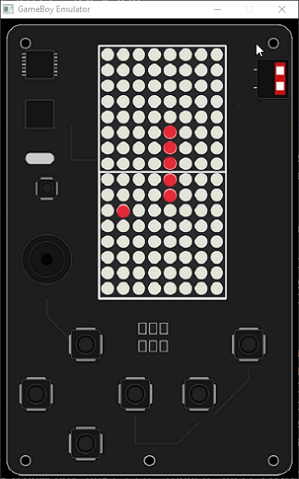

# GameBoyWin 🎮 [скачати зіпку](https://github.com/robocode-pb/GameBoyWin/archive/refs/heads/main.zip)



**GameBoyWin** — це легкий емулятор та середовище для запуску Arduino-скетчів, написаних під бібліотеку `GameBoy.h`, прямо на ОС Windows. Для візуалізації LED-екрану та обробки натискань клавіш використовується графічна бібліотека **raylib**. 

Проект містить у собі вбудований портативний компілятор, що дозволяє збирати та запускати ігри в один клік без необхідності встановлювати додаткове ПЗ чи налаштовувати змінні середовища.

Наразі як головний приклад у проекті реалізована класична гра **Snake (Змійка)**.

---

## 📂 Структура проекту

```text
GameBoyWin/
├── GameBoyWin/                       # Папка з вихідним кодом емулятора та ресурсами
│   ├── raylib-6.0_win64_mingw-w64/   # Графічна бібліотека Raylib (include/lib)
│   ├── w64devkit-x64-2.8.0.7z.exe    # Запакований портативний компілятор (SFX-архів)
│   ├── Arduino.h                     # Симуляція базових функцій Arduino
│   ├── GameBoy.h                     # Головна бібліотека емуляції пристрою
│   ├── imgs/                         # Графічні ресурси інтерфейсу (GameBoy.png тощо)
│   ├── main.cpp                      # Вхідна точка (код самого емулятора)
│   └── run.bat                       # Внутрішній скрипт компіляції, аналізу та запуску
├── .temp/                            # Створюється автоматично (МОЖНА СМІЛИВО ВИДАЛЯТИ)
│   ├── w64devkit/                    # Розпакований сюди важкий компілятор GCC/G++
│   └── emulator.exe                  # Готовий скомпільований бінарник твоєї гри
├── make.bat                          # Запуск
└── sketch.ino                        # Твій актуальний Arduino-код (наразі гра Змійка)
```

Папку 'GameBoyWin/.temp' безпечно видаляти щоб зменшити розміри

---

## 🚀 Як запустити проект

Проект є повністю автономним (portable). Тобі не потрібно встановлювати MinGW, Arduino IDE чи інші програми.

1. Перейди до кореневої папки `GameBoyWin`.
2. Запусти файл **`make.bat`** (двома кліками миші).
3. Скрипт автоматично:
* Підключить локальний компилятор `w64devkit`.
* Скомпілює твій актуальний код із `sketch.ino` разом із емулятором.
* Запустить гру у красивому графічному вікні.
---

## 💻 Приклад коду (`sketch.ino`)

Емулятор повністю повторює логіку Arduino з функціями `setup()` та `loop()`. Ось спрощений вигляд того, як влаштована гра всередині:

```cpp
#include "GameBoy.h"
GameBoy gb;

void setup(){
    gb.begin(0);
}

int x=4,y=4;

void loop(){
    // gb.debug();
    int key=gb.getKey();
    if(key==RIGHT && x<7 ) x++;  
    if(key==LEFT  && x>0 ) x--;
    if(key==UP    && y>0 )  y--;
    if(key==DOWN  && y<15) y++;

    gb.clearDisplay();
    gb.drawPoint(x, y);
    delay(100);
}

```


---

TODO:
- звук
- декомпозиція
- більше арду фішок
- відвязка від жорстокого scetch.ino
- може зменшити розмір тулчейну
- докстрінги
- іконка
- додати вбудований редактор ?
- перейти на svg (або щось інше) і відв'язатись від захардкожених кординат
- зробити самостійний екзе
- портувати на інші платформи ?
- відмовитись від с++ і перейти на луа )))
- подякувати джеміні 